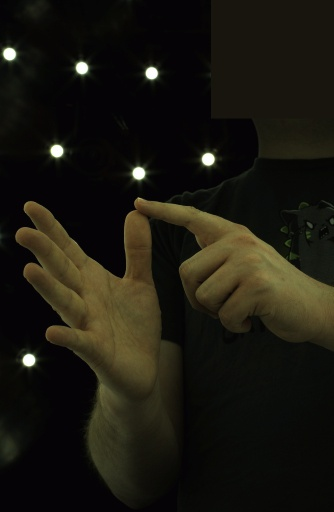
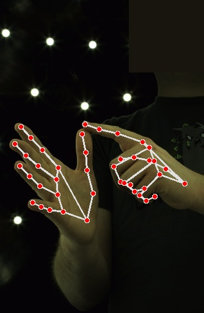
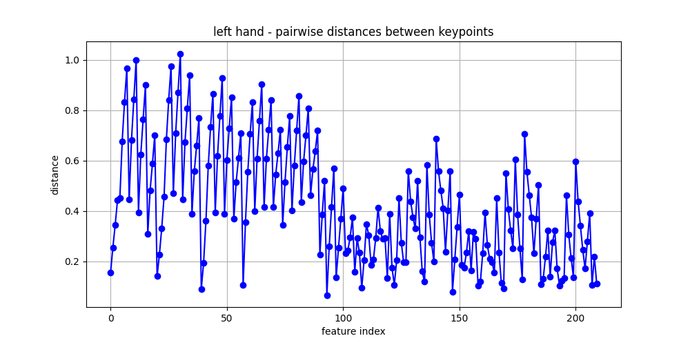
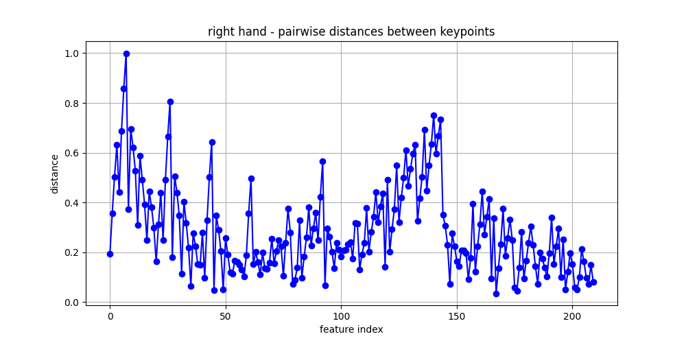
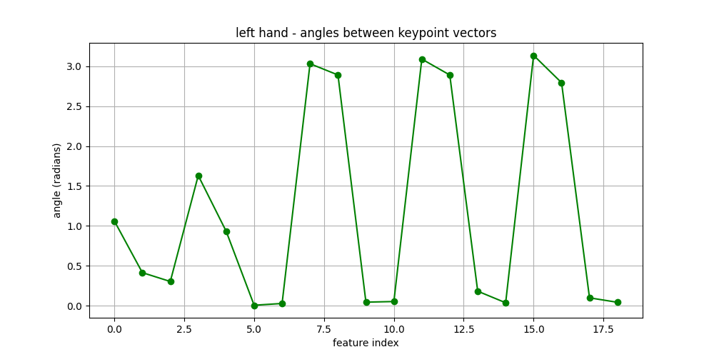
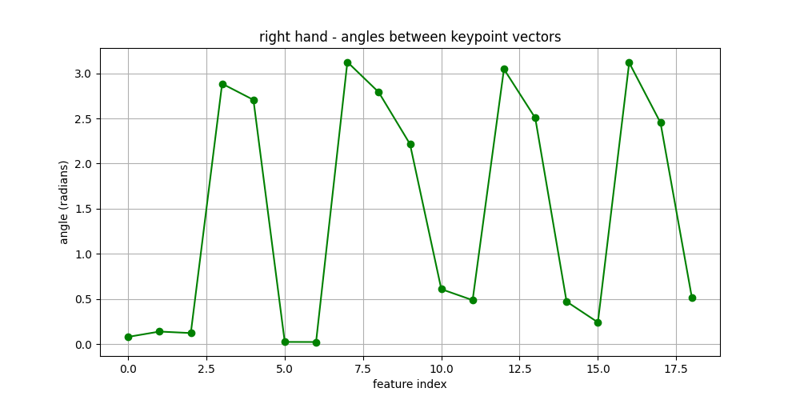

# Project Name: 3D Hand Gesture Recognition Using MediaPipe Keypoints

## Part 1: High-Level Solution (Revised)

The goal of this project is to create a 3D hand gesture recognition system using keypoints detected by MediaPipe. By utilizing MediaPipe's real-time hand-tracking capabilities, the focus will be shifted from developing a full 3D pose estimation model to building a classifier that works on top of pre-detected keypoints to recognize gestures. 

### Key Objectives (Revised):
1. **Keypoint Detection (MediaPipe):** Instead of building a custom 3D hand pose estimator from scratch, the system will use MediaPipe, which can detect 21 keypoints of the hand in real time from RGB input. This step will serve as the foundation for the project, handling the initial hand segmentation and keypoint extraction.

2. **Feature Extraction:** After obtaining the keypoints from MediaPipe, the next step is to extract features from these keypoints. These features will represent important hand joints such as the knuckles, fingertips, and wrist.

3. **Gesture Classification:** The primary focus will be on building a machine learning classifier to recognize hand gestures based on the extracted keypoints. The model can be trained to identify predefined gestures such as thumbs-up, OK sign, or other hand poses commonly used in human-computer interaction.

4. **Real-time Performance:** Since MediaPipe provides real-time hand tracking, the system should be able to process video streams at 15–30 frames per second (FPS). The classifier for gesture recognition will need to be optimized for speed to ensure real-time performance.

### Challenges and Learning Goals

1. **MediaPipe Keypoints as Features**:
   Instead of extracting raw 3D positions, this project will focus on utilizing the 2D keypoints detected by MediaPipe. The challenge will be to design features or feature transformations that can improve the gesture classification accuracy.
   

### Image Properties and Features

The project will use the 21 keypoints detected by MediaPipe, including:
- **Knuckles**
- **Fingertips**
- **Wrist**

## Part 2: Dataset

The dataset used for this project is a portion of the **InterHand2.6M** dataset. The dataset is designed for **3D interacting hand pose estimation** from single RGB images.

The dataset originates from the paper **"InterHand2.6M: A Dataset and Baseline for 3D Interacting Hand Pose Estimation from a Single RGB Image"** (Gyeongsik Moon, Shoou-I Yu, He Wen, Takaaki Shiratori, Kyoung Mu Lee, ECCV 2020), which can be accessed [here](https://arxiv.org/abs/2008.09309).

### Source Information:
- **Dataset name**: InterHand2.6M (Parts `aa`, `ab`, `ac` only)
- **Download link**: [InterHand2.6M Download](https://fb-baas-f32eacb9-8abb-11eb-b2b8-4857dd089e15.s3.amazonaws.com/InterHand2.6M/InterHand2.6M.images.5.fps.v1.0/index.html)
- **Associated paper**: [InterHand2.6M paper](https://arxiv.org/abs/2008.09309)

### Dataset Description:
The InterHand2.6M dataset contains a total of 2.6 million frames, but for the scope of this project, I am using only parts `aa`, `ab`, and `ac`. This subset includes RGB images captured at **5 frames per second** (fps) and annotated with accurate **3D hand joint positions**. These hand poses consist of both **single and interacting hand poses**, which will help in building a robust hand gesture recognition model.

- **Subjects and Samples**: The dataset contains a wide range of hand poses from multiple subjects, with varying hand sizes and shapes, which will contribute to a more generalizable model.
- **Frames per Subject**: Since I am using a subset of the full dataset, the exact number of samples per subject varies, but each part (`aa`, `ab`, `ac`) includes thousands of frames with labeled hand joints.
- **Resolution**: The RGB images are captured at a high resolution, which allows for detailed extraction of keypoints and hand features.

#### Folder Breakdown:
Here are the folders used in this project and the number of images in each:

- **ROM01_No_Interaction_2_Hand**: 24,742 images
   - Number of subjects: 139
   - Images per subject: 178
   - Contains two hands with no interaction between them.
  
- **ROM02_Interaction_2_Hand**: 24,742 images
   - Number of subjects: 139
   - Images per subject: 178
   - Contains interacting hands, which introduces complexities such as occlusion and complex hand postures.

- **ROM03_LT_No_Occlusion**: 55,600 images
   - Number of subjects: 139
   - Images per subject: 400
   - Left hand (LT) with no occlusions.

- **ROM04_LT_Occlusion**: 20,989 images
   - Number of subjects: 139
   - Images per subject: 151
   - Left hand (LT) with occlusion.

- **ROM04_RT_Occlusion**: 20,294 images
   - Number of subjects: 139
   - Images per subject: 146
   - Right hand (RT) with occlusion. 

- **ROM05_RT_Wrist_ROM**: 13,066 images
   - Number of subjects: 139
   - Images per subject: 94
   - Captures the range of motion (ROM) of the right wrist.

- **ROM07_Rt_Finger_Occlusions**: 24,464 images
   - Number of subjects: 139
   - Images per subject: 176
   - Right-hand finger occlusions.

- **ROM08_Lt_Finger_Occlusions**: 26,549 images
   - Number of subjects: 139
   - Images per subject: 191
   - Left-hand finger occlusions.

- **ROM09_Interaction_Fingers_Touching**: 26,376 images
   - Number of subjects: 42
   - Images per subject: 628
   - Contains images where fingers are interacting or touching.

### Splitting the Dataset:
To ensure the model can generalize effectively, the dataset is split into three subsets: **Training (60%)**, **Validation (20%)**, and **Testing (20%)**. 

- **Training (60%)**: This subset will be used to train the gesture recognition model. The training data includes a wide variety of hand poses, angles, and backgrounds to ensure that the model can generalize well.
- **Validation (20%)**: This subset will be used to fine-tune the model, checking for overfitting and helping adjust hyperparameters. 
- **Testing (20%)**: The testing subset is used for the final evaluation, where it will be used to assess the model’s performance on unseen data.

## Part 3: Data Pre-processing and Feature Extraction

### Data Subsetting and Preparation
Given the substantial size of the InterHand2.6M dataset, I downloaded and extracted only specified parts of the dataset (aa, ab, and ac), focusing on images captured at 5 frames per second (fps). This subset contains diverse hand poses, including single and interacting gestures.

To complement the subset of images, I also extracted the relevant annotations from the provided metadata files though I am still figuring out how I will use these annotations.

I then split the subset of the dataset as training set (60%), validation set (20%), testing set (20%).

(Since the subset of the InterHand2.6M dataset is still quite large, I only push the annotation files to the repository instead of the full dataset.)

### Methods Applied for Feature Extraction
1. **Keypoint Detection**
   - I used MediaPipe Hands to detect 21 keypoints for both left and right hands. These keypoints include crucial hand joints, such as the wrist, knuckles, and fingertips.
   - MediaPipe's pre-trained model offers high accuracy real-time detection capabilities, so I aslo implemented real-time keypoint detection using MediaPipe.
   - Here is an illustration of the keypoint detection results:

   
   

2. **Keypoint Normalization**
   - Scaling: The detected keypoints were scaled based on the image dimensions (314 x 512).
   - Centering: The keypoints were centered around the wrist to make features invariant to the position of the hand within the image.
   - Distance Normalization: I normalized the distances of keypoints relative to the wrist to account for variations in hand size. The distances were scales such that the largest distance became 1, ensuring uniformity across samples.

3. **Feature Extraction**
   - **Pairwise Euclidean Distance:** I computed pairwise Euclidean distance between normalized keypoints to capture the relative spatial arrangement of hand joints, providing a feature set that reflects the overall shape and sturcture of the hand.
   - **Angles Between Keypoint Vectors:** I also calculated angles between consecutive keypoint vectores to provide additional geometric information.

### Reasons for Using These Algorithms/Models
- **MediaPipe Hands**: I decided to use MediaPipe Hands because of its efficiency and high accuracy in detecting hand keypoints. The model is well-optimized for real-time applications and can handle complex hand poses, which is essential for gesture recognition.
- **Keypoint Normalization**: Scaling, centering, and distance normalization were used to make the features invariant to the hand’s position, orientation, and size in the image. These transformations help in creating a standardized representation of the hand.
- **Pairwise Euclidean Distances**: I think pairwise Euclidean distances are a good way to represent the overall shape and structure of the hand. Since gestures are defined by how the fingers and joints are positioned relative to each other, using these distances helps the model pick up on the subtle differences between various hand poses.

   Here is an example plot for the pairwise Euclidean distances:

   
   

- **Angles Between Keypoint Vectors**: I think calculating angles between keypoint vectors adds another layer of useful information. This feature captures the curvature and orientation of the hand, making it particularly helpful for distinguishing between gestures that might look similar in shape but differ in the way they’re oriented.

   Here is an example plot for the angles between vectors:

   
   

### Repo Stucture

```
annotations/
│
├── test/
│   ├── InterHand2.6M_camera.json
│   ├── InterHand2.6M_data.json
│   ├── InterHand2.6M_joint_3d.json
│   └── InterHand2.6M_MANO_NeuralAnnot.json
│
├── train/
│   ├── InterHand2.6M_camera.json
│   ├── InterHand2.6M_data.json
│   ├── InterHand2.6M_joint_3d.json
│   └── InterHand2.6M_MANO_NeuralAnnot.json
│
└── val/
    ├── InterHand2.6M_camera.json
    ├── InterHand2.6M_data.json
    ├── InterHand2.6M_joint_3d.json
    └── InterHand2.6M_MANO_NeuralAnnot.json


data/
│
├── test/
│   ├── ROM01_No_Interaction_2_Hand/
│   ├── ROM02_Interaction_2_Hand/
│   ├── ROM03_LT_No_Occlusion/
│   ├── ROM04_LT_Occlusion/
│   ├── ROM04_RT_Occlusion/
│   ├── ROM05_RT_Wrist_ROM/
│   ├── ROM07_Rt_Finger_Occlusions/
│   ├── ROM08_Lt_Finger_Occlusions/
│   └── ROM09_Interaction_Fingers_Touching/
│
├── train/
│   ├── ROM01_No_Interaction_2_Hand/
│   ├── ROM02_Interaction_2_Hand/
│   ├── ROM03_LT_No_Occlusion/
│   ├── ROM04_LT_Occlusion/
│   ├── ROM04_RT_Occlusion/
│   ├── ROM05_RT_Wrist_ROM/
│   ├── ROM07_Rt_Finger_Occlusions/
│   ├── ROM08_Lt_Finger_Occlusions/
│   └── ROM09_Interaction_Fingers_Touching/
│
└── val/
    ├── ROM01_No_Interaction_2_Hand/
    ├── ROM02_Interaction_2_Hand/
    ├── ROM03_LT_No_Occlusion/
    ├── ROM04_LT_Occlusion/
    ├── ROM04_RT_Occlusion/
    ├── ROM05_RT_Wrist_ROM/
    ├── ROM07_Rt_Finger_Occlusions/
    ├── ROM08_Lt_Finger_Occlusions/
    └── ROM09_Interaction_Fingers_Touching/

sample/
│
├── ROM01_No_Interaction_2_Hand/
├── ROM02_Interaction_2_Hand/
├── ROM03_LT_No_Occlusion/
├── ROM04_LT_Occlusion/
├── ROM04_RT_Occlusion/
├── ROM05_RT_Wrist_ROM/
├── ROM07_Rt_Finger_Occlusions/
├── ROM08_Lt_Finger_Occlusions/
└── ROM09_Interaction_Fingers_Touching/

sample_feature/
sample_keypoint/

src/
│
├── feature_extraction.py
├── feature_extraction.sh
├── filter_annotations.py
├── hand_keypoint_visualizer.py
├── keypoint_detection.py
├── keypoint_detection.sh
└── split_data.py

.gitignore
README.md
requirements.txt

```

### Instructions to Run the Code

Make sure you have installed the required dependencies. You can do this by using a `requirements.txt` file or by manually installing:

`pip install opencv-python mediapipe json argparse`

- **Keypoint Detection:**

The script takes an input image, detects the keypoints of hands present in the image, and saves both the keypoints and the image with keypoints annotated. For example,

```
python src/keypoint_detection.py --input sample/ROM09_Interaction_Fingers_Touching/image29679.jpg --output sample_keypoint/image29679
```

This will process the input image and save keypoints to the `json` file as well as the image with annotated keypoints.

Format of the `json` file:

```
{
  "left": [list of keypoints],
  "right": [list of keypoints]
}
```


There are other sample images in the `sample` folder.

- **Hand Keypoint Visualizer:**

This script captures video from your webcam, detects hand keypoints in real-time using MediaPipe Hands, and visualizes the keypoints on the video stream using OpenCV. The visualized keypoints are connected to highlight the structure of the hand.

```
python src/hand_keypoint_visualizer.py
```

- **Feature Extraction:**

This script extracts features from 3D hand keypoints data, such as pairwise Euclidean distances between keypoints and angles between keypoint vectors. It also visualizes the extracted features and saves them as plots. For example,

```
python src/feature_extraction.py --input sample_keypoint/image29679.json --output sample_feature/image29679
```

This process the `json` output from `keypoint_detection.py` as the input, extracting features and save them to the `json` file. It also plots the extracted features and save them as `png` images.

Format of the `json` file:

```
{
  "left": {
    "distances": [<list_of_distances>],
    "angles": [<list_of_angles>]
  },
  "right": {
    "distances": [<list_of_distances>],
    "angles": [<list_of_angles>]
  }
}
```


